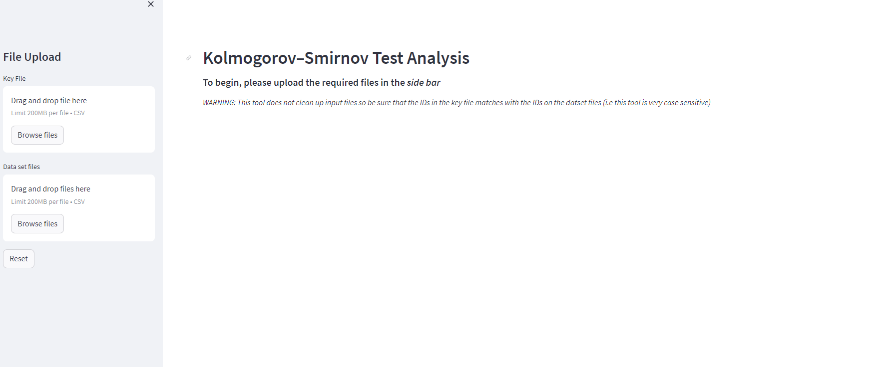
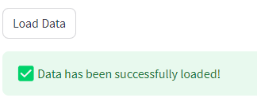

# Kolmogorov–Smirnov Test Analysis Web App
### R code originally developed by Akshar Lohith 
### Converted and modified into Python by Derfel Terciano

## Description and Warnings
This is a web app that generates all analytics for the Kolmogorov–Smirnov Test when
given multiple datasets that share a similar compounds by a given key.

The Web App was developed in python while the front-end was developed with
Streamlit, a python front-end development library. 

The web app contains analytics dispayed as bar plots, scatter plots, and step plots.
Additionally, the main most of the displayed images are downloadable from the web app.

### If you would like a demo, you can try the web app on the [Streamlit website here](https://kstestanalysis.streamlit.app/).
*NOTE:* Due to the limited resources that the Streamlit cloud provides, **we do not recommend that you use the tool to its fullest extent on the**
**Streamlit website**. Instead, we recommend running the web app locally through a docker image (*instructions provided below*). Trying to use
the app to its fullest extent on the streamlit site will cause the program to crash. 
- *If the app is not up and running on the link above please email <dtvsworld@gmail.com>.*

## Installation

In order to run the webapp locally, you must use a docker image. To pull the docker images use the following command:
- `docker pull wonderfel/kstestanalysisapp`
    - *NOTE:* This is only under the assumption that the user has the Docker Engine installed already.
    - For more info visit the [Docker site](https://docs.docker.com/engine/install/)!

Once you have pulled the docker image, you can finally launch the webapp locally by using the following command:
- `docker run -p 8501:8501 streamlit`

To access the web app, open your favorite browser and enter one of the links below:
- <http://localhost:8501>
- <http://0.0.0.0:8501>

## Web app usage:

Once you run the web app locally, you should be presented with the following:

#### Let's upload some files!
To begin, let's make sure we have a key file and a set of dataset files.
***NOTE: the web app only accepts .csv file types***

Once, you have your files processed and ready to go you may now begin uploading each correspoinding file to the appropriate location in the web app. (See demonstration below)

After uploading your files, you should now be presented with an *Output Options* section, here you need to select your compound classes and the well IDs.

Optionally, you can also select which compounds to exclude from the calculations. Why might you want to exclude some classes? One possibility is because there may be compounds in the dataset that have no well IDs associated to them.

Additionally, you also have the option to edit the names of your datasets to make it easier to identify which dataset is what.

Here is an example of the options below:

Next, hit the load button data to generate all the calculations from the datasets.
If you have processed eveything correctly, you should get a message stating that the data has been successfully loaded.

#### Generating Figures

Now, you should be able to generate the eCDF plots and see their corresponding p-values. In addition, you should be able to download all the plots into a single pdf.
If you don't want to examine all the compounds, you can also select only certain compounds to view/download.

If you would like to examine the P-values for the datasets, there is a tab dedicated to only the P-values of the datasets that contains downloadable tables of the all P-Values, an interactive scatter plot that shows the P-Value distributions and a couple bar graphs that show how many compound classes are above the -log10(0.01) and -log10(0.05) thresholds.
